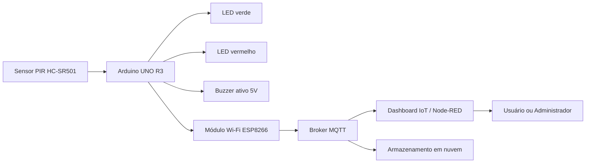

# Arquitetura IoT Proposta

Este diagrama representa a arquitetura proposta para evolução do protótipo de Sistema de Iluminação Pública Inteligente baseado em IoT.



## Descrição da Arquitetura

A arquitetura proposta considera o uso do Arduino UNO R3 como unidade central de controle do protótipo. O sensor PIR HC-SR501 realiza a detecção de presença ou movimento e envia essa informação ao Arduino.

Quando há presença detectada, o Arduino aciona os atuadores locais, representados pelo LED vermelho e pelo buzzer. Em estado normal, o LED verde permanece ligado.

Como evolução para Internet das Coisas, o sistema poderá utilizar um módulo Wi-Fi ESP8266 para enviar dados a um broker MQTT. Esses dados poderão ser visualizados em um dashboard, como o Node-RED, permitindo acompanhamento remoto dos estados do sistema.

## Elementos da Arquitetura

| Elemento | Função |
|---|---|
| Sensor PIR HC-SR501 | Detectar presença ou movimento |
| Arduino UNO R3 | Processar os sinais e controlar os atuadores |
| LED verde | Indicar estado de repouso |
| LED vermelho | Indicar presença detectada |
| Buzzer ativo 5V | Emitir alerta sonoro |
| ESP8266 | Permitir comunicação Wi-Fi |
| Broker MQTT | Intermediar a troca de mensagens IoT |
| Dashboard IoT / Node-RED | Visualizar os dados do sistema |
| Usuário ou Administrador | Acompanhar o funcionamento do sistema |
| Armazenamento em nuvem | Registrar eventos para análise futura |

## Proposta de Comunicação MQTT

Na etapa futura do projeto, o sistema poderá publicar mensagens em tópicos MQTT, como:

```text
iluminacao/status
iluminacao/presenca
iluminacao/alerta
```

Esses tópicos poderão informar se o sistema está em repouso, se houve presença detectada ou se algum alerta foi acionado.
