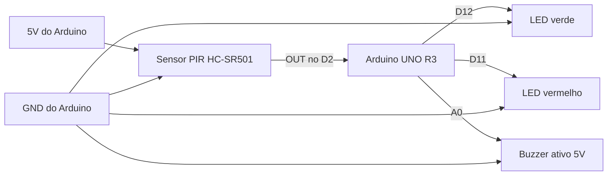

# Esquema de Ligações dos Componentes

Este documento apresenta o esquema de ligação dos componentes utilizados no protótipo do Sistema de Iluminação Pública Inteligente baseado em IoT.

## Ligações com o Arduino UNO R3

| Componente | Pino do Componente | Ligação no Arduino |
|---|---|---|
| Sensor PIR HC-SR501 | VCC | 5V |
| Sensor PIR HC-SR501 | GND | GND |
| Sensor PIR HC-SR501 | OUT | D2 |
| LED verde | Ânodo | D12 |
| LED verde | Cátodo | GND com resistor de 220 ohms |
| LED vermelho | Ânodo | D11 |
| LED vermelho | Cátodo | GND com resistor de 220 ohms |
| Buzzer ativo 5V | Positivo | A0 |
| Buzzer ativo 5V | Negativo | GND |

## Diagrama Simplificado

## Descrição das Ligações

O sensor PIR HC-SR501 é alimentado pelo pino 5V do Arduino e conectado ao GND. O pino de saída do sensor é ligado ao pino digital D2, responsável por informar ao Arduino quando há presença ou movimento.

O LED verde está conectado ao pino D12 e representa o estado de repouso do sistema. O LED vermelho está conectado ao pino D11 e representa o estado de presença detectada. Ambos utilizam resistores de 220 ohms para proteção.

O buzzer ativo 5V está conectado ao pino A0 e é acionado quando o sensor PIR detecta movimento.
