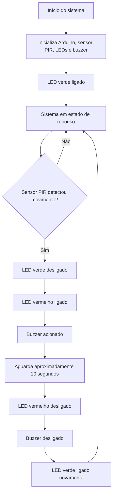

# Fluxograma de Funcionamento do Sistema

Este fluxograma representa a lógica de funcionamento do protótipo de Sistema de Iluminação Pública Inteligente baseado em IoT.

## Descrição do Fluxo

O sistema inicia configurando os pinos do Arduino, do sensor PIR, dos LEDs e do buzzer. Em seguida, entra em estado de repouso com o LED verde ligado.

Quando o sensor PIR detecta movimento, o sistema desliga o LED verde, liga o LED vermelho e aciona o buzzer. Após aproximadamente 10 segundos, o LED vermelho e o buzzer são desligados, e o LED verde volta a indicar o estado normal do sistema.

## Estados Representados

| Estado | Condição | Ação do Sistema |
|---|---|---|
| Repouso | Nenhum movimento detectado | LED verde ligado |
| Presença detectada | Movimento identificado pelo PIR | LED vermelho e buzzer acionados |
| Retorno ao repouso | Após o tempo programado | LED verde ligado novamente |
