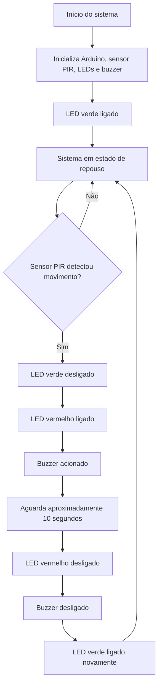

# Fluxograma de Funcionamento do Sistema

Este fluxograma representa a lógica de funcionamento do protótipo de Sistema de Iluminação Pública Inteligente baseado em IoT.

## Descrição do Fluxo

O sistema inicia configurando os pinos do Arduino, do sensor PIR HC-SR501, dos LEDs e do buzzer. Em seguida, aguarda aproximadamente 60 segundos para estabilização inicial do sensor PIR.

Após a estabilização, o sistema entra em estado de repouso, mantendo o LED verde ligado, o LED vermelho desligado e o buzzer desligado.

Quando o sensor PIR detecta movimento, o Arduino registra a presença detectada, desliga o LED verde, liga o LED vermelho e aciona o buzzer. Esse estado de alerta permanece ativo por aproximadamente 10 segundos.

Após o tempo programado, o LED vermelho e o buzzer são desligados, o LED verde volta a ficar ligado e o sistema retorna ao estado de repouso. Durante esse processo, o Arduino envia mensagens pela comunicação USB/Serial, como PRESENCA_DETECTADA e REPOUSO, que podem ser utilizadas pelo Node-RED para integração com MQTT e dashboard.

## Estados Representados

| Estado | Condição | Ação do Sistema |
|---|---|---|
| Repouso | Nenhum movimento detectado | LED verde ligado |
| Presença detectada | Movimento identificado pelo PIR | LED vermelho e buzzer acionados |
| Retorno ao repouso | Após o tempo programado | LED verde ligado novamente |
